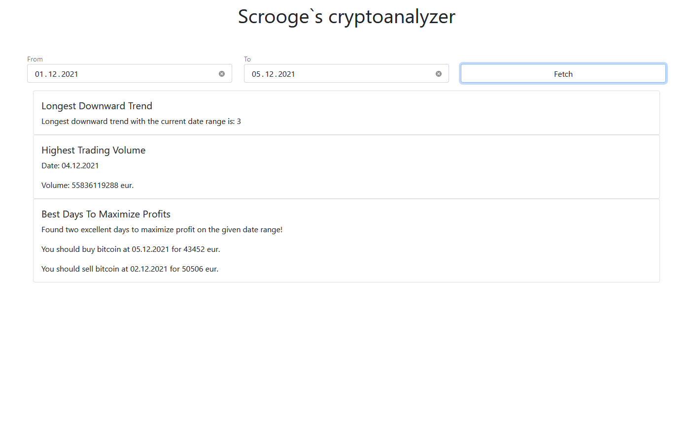

# Vincit pre-assignment

The task was to create an application (with the technology of my own choosing) where you can get different information for different date ranges.

## Scrooge`s cryptoanalyzer

Application has a very minimalistic user interface. You can pick a date range and then press the `fetch` button, to display different analytic information about bitcoin prices and volumes.

The application is hosted at Heroku:
[https://polar-ridge-59068.herokuapp.com/](https://polar-ridge-59068.herokuapp.com/)



### Installation

Clone the project from `url here` i.e.

```[cmd]
git clone https://github.com/k0psutin/vincit-rising-star vincit-rising-star
```

Go to the newly created folder and install neccessary modules:

```[cmd]
cd vincit-rising-star
npm i
```

Create an `.env` file on the root directory of the project and create an environment variable:

```[cmd]
REACT_APP_API_URI = https://api.coingecko.com/api/v3/coins/bitcoin/market_chart/
```

To launch the application, simply write `npm start` at the root, enjoy!

### Unit tests

The application has a few simple unit tests for different functions, you can run the tests with:

```[cmd]
npm run test
```
